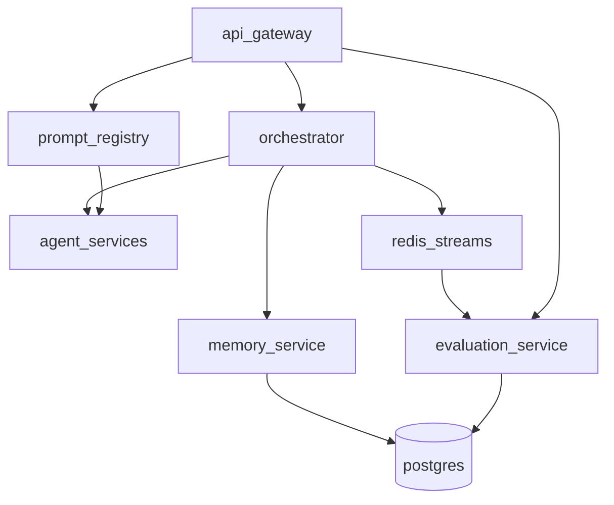
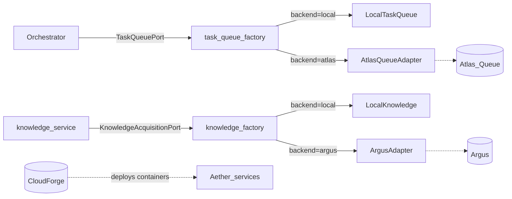

# Aether Architecture Overview

## System Context

Aether is an API-first multi-agent orchestration platform. Clients send messages to the API Gateway, which triggers orchestration workflows executed by specialized agent microservices.

## Component Diagram

See [README.md](../../README.md) for service ports and quick start.

## Video Demos

Walkthroughs of the request flow, async workflows, knowledge acquisition, and observability live in [docs/demos/README.md](../demos/README.md).

## Request Flow

1. Client creates a conversation via `POST /v1/conversations`
2. Client sends a message via `POST /v1/conversations/{id}/messages`
3. API Gateway forwards to Orchestrator
4. Orchestrator loads context from Memory Service
5. Planner Agent decomposes the task into a directed task graph
6. Orchestrator executes agents in topological order (pausing for approval if required)
7. Context, usage, and artifacts are persisted after each agent execution
8. Evaluation Service scores completed workflows from Redis Stream events
9. Response Builder streams SSE events back to the client

## Phase 3 Architecture

## Ecosystem Integration Architecture

Aether anticipates integration with **Atlas Queue**, **Argus**, and **CloudForge** without tight coupling. External systems are accessed through Protocol ports and config-selected adapters in `aether-common/integrations/`.

### Integration boundaries

| Concern | Aether owns | External platform owns |
|---------|-------------|------------------------|
| Workflow orchestration | Orchestrator, agents | — |
| Background job execution | `TaskQueuePort` adapter | Atlas Queue workers |
| Web crawl / ETL | `KnowledgeAcquisitionPort` adapter | Argus pipeline |
| AWS infrastructure | Health/metrics contract | CloudForge Terraform |

Default configuration (`TASK_QUEUE_BACKEND=local`, `KNOWLEDGE_BACKEND=local`) requires no sibling services.

See:
- [ADR-014](../adr/ADR-014-ecosystem-adapter-layer.md) — Adapter layer
- [ADR-015](../adr/ADR-015-atlas-queue-integration.md) — Atlas Queue
- [ADR-016](../adr/ADR-016-argus-integration.md) — Argus
- [ADR-017](../adr/ADR-017-cloudforge-deployment-contract.md) — CloudForge
- [CloudForge deployment contract](../deployment/cloudforge-integration.md)

## Design Principles

- **Clean Architecture**: domain → application → infrastructure → presentation per service
- **Replaceable agents**: AgentProtocol + Redis registry
- **Provider-agnostic LLM**: OpenAI, Anthropic, or mock fallback
- **Ecosystem adapters**: ports + factory; no imports from sibling repos
- **Observability by default**: structured logging, OTEL traces, Prometheus metrics
- **Governance**: evaluation, prompt versioning, cost tracking, human approval

## Phase 3 Capabilities

- Evaluation engine via `evaluation-service`
- Prompt versioning via `prompt-registry`
- Experiment and cost tracking via `memory-service`
- Human approval workflows via orchestrator pause/resume
- Grafana dashboards for agent performance and cost trends
- Ecosystem integration scaffolding (Atlas Queue, Argus, CloudForge contract)
