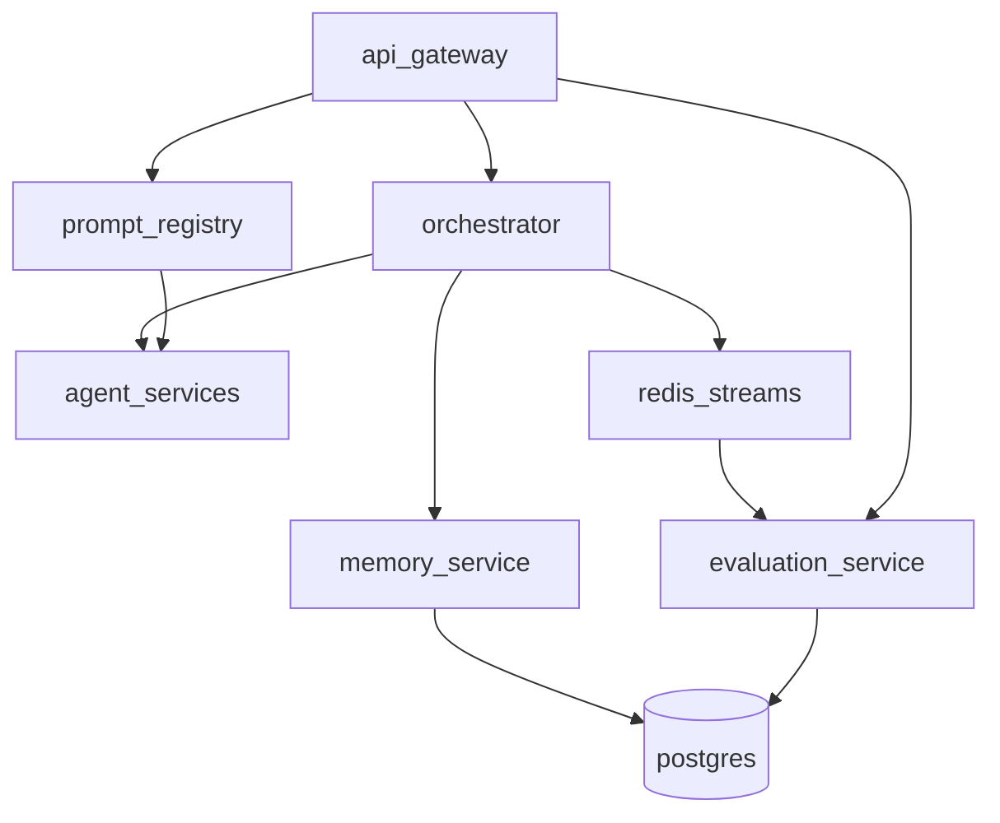

# Aether Architecture Overview

## System Context

Aether is an API-first multi-agent orchestration platform. Clients send messages to the API Gateway, which triggers orchestration workflows executed by specialized agent microservices.

## Component Diagram

See [README.md](../../README.md) for service ports and quick start.

## Request Flow

1. Client creates a conversation via `POST /v1/conversations`
2. Client sends a message via `POST /v1/conversations/{id}/messages`
3. API Gateway forwards to Orchestrator
4. Orchestrator loads context from Memory Service
5. Planner Agent decomposes the task into a directed task graph
6. Orchestrator executes agents in topological order (pausing for approval if required)
7. Context, usage, and artifacts are persisted after each agent execution
8. Evaluation Service scores completed workflows from Redis Stream events
9. Response Builder streams SSE events back to the client

## Phase 3 Architecture

## Design Principles

- **Clean Architecture**: domain → application → infrastructure → presentation per service
- **Replaceable agents**: AgentProtocol + Redis registry
- **Provider-agnostic LLM**: OpenAI, Anthropic, or mock fallback
- **Observability by default**: structured logging, OTEL traces, Prometheus metrics
- **Governance**: evaluation, prompt versioning, cost tracking, human approval

## Phase 3 Capabilities

- Evaluation engine via `evaluation-service`
- Prompt versioning via `prompt-registry`
- Experiment and cost tracking via `memory-service`
- Human approval workflows via orchestrator pause/resume
- Grafana dashboards for agent performance and cost trends
